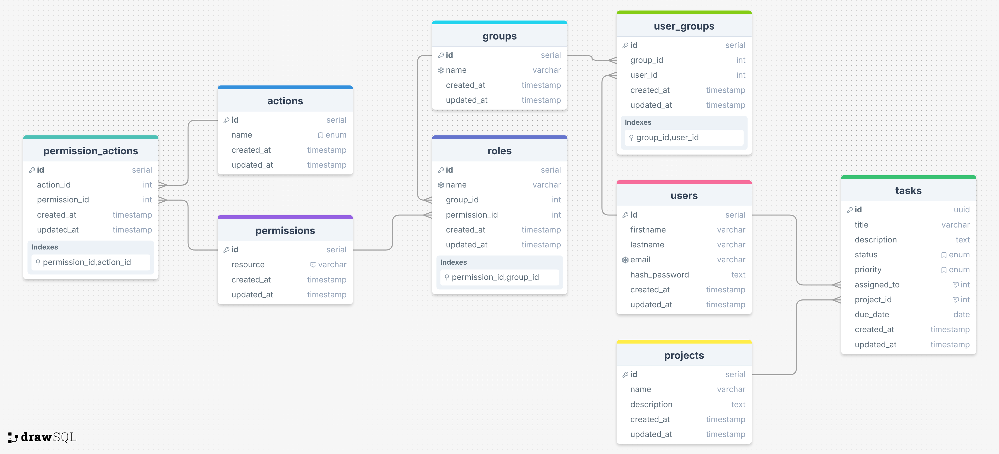

<p align="center">
  
</p>
<h3 align="center">TASK MANAGEMENT SYSTEM</h3>
<hr>

This project models a mini version of a **Task Management System** with focus on **database design, normalization**, and **Java integration using JDBC**. It simulates real-world task manager involving `tasks`, `projects`, `users`, and `permissions`.

---

## 💼 Project Overview

This lab project includes:

- Designing an `ERD` based on hospital structure
- Implementing the schema in `PostgresSQL` with relationships and constraints
- Connecting a Java application to the database using `JDBC`
- Performing `CRUD` operations on the `Task`, `Project`, `User` entities

---

## 🛠️ Key Features

- 🧱 **Relational Database Design**
  - ER model and schema normalization
  - Primary and foreign key constraints
- 💾 **SQL Implementation**
  - Scripts for table creation and relationships
- 🔗 **Java JDBC Integration**
  - Database connectivity with proper exception handling
- ✍️ **CRUD Operations**
  - Add, read, update, and delete patient records using Java

---
## 🧩 ER Diagram


---

## 🧱 Design Pattern: MVC

This application follows the MVC (Model-View-Controller) architecture with a DAO (Data Access Object) layer for persistence.

- Model: Java classes representing entities (e.g., Task, Project, User).

- DAO: Encapsulates database logic (e.g., TaskRepository, ProjectRepository).

- Controller: Handles user interactions and business logic (e.g., SessionController).

- View: Provide GUI using `JSP` and they are directly dispatched from within respective `controller`.

---

## 📁 Project Structure & Configuration

### 🛠️ Environment Configuration
This project uses **environment variables** for secure and flexible database configuration.
- Environment variables are stored in a `.env.local` file (not committed to version control).
- Managed to use the [`dotenv-java`](https://github.com/cdimascio/dotenv-java) library.
- Example environment variables:
```
DB_URL=jdbc:postgresql://localhost:5432/<YOUR_DB_NAME>
DB_USER=<YOUR_DB_USER>
DB_PASS=<YOUR_DB_PASSWORD>
DB_MAX_POOL_SIZE=10
QUERY_PAGE_THRESHOLD=25
MIGRATION_LOCATION="filesystem:src/main/resources/migrations"
```

N.B: Configuration read from the `.env.local` are automatically available via `com.taskmis.config.Env` class.
---

## ⚙️ Technologies Used


- JDBC
- JSP
- Java EE
- ERD Modeling Tool ([drawSQL.app](https://drawSQL.app))

---

## 📹 Live Demo

- [Video](https://docs.google.com/document/d/1-czFPgyewYvBQ3D7rOwlwfCC5RBqb8AxpIzVHIfEBAY/edit?usp=sharing)
- [Project Guidelines](https://amalitech-training.notion.site/Task-Management-System-1ca6c750c0d581a290e4c22fca589925)

---

## 🧑‍💻 How to Run

> Requires Java 17

1. Clone the repository ([link](https://github.com/sntakirutimana72/task-management-system))
2. Setup `postgres` database locally and create a database, then add the `DB NAME` to the `DB_URL` variable in `.env.local`.
3. Also, add `migrations` directory to `.env.local` as `MIGRATION_LOCATION`. It's better all migrations are based in `src/main/resources/migrations`.
4. Create an `.env.local` file inside `src/main/resources/.env.local` to store the DB credentials in Java
5. Run the Java application to perform CRUD operations

---

## Authors

👤 **Steve**
- GitHub: [@sntakirutimana72](https://github.com/sntakirutimana72/)

---

## 🤝 Contributing

Contributions, issues, and feature requests are welcome!

Feel free to check the [issues page](https://github.com/sntakirutimana72/task-management-system/issues/)

---

## Show your support

Give a ⭐️ if you like this project!

---

## Acknowledgments

- Devs Communities for great free and resourceful articles.
